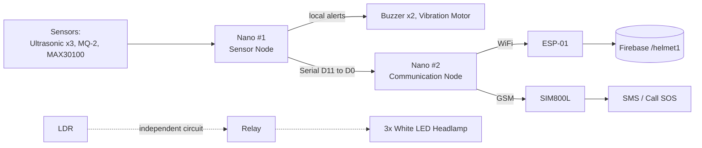
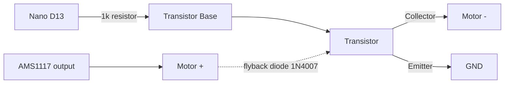
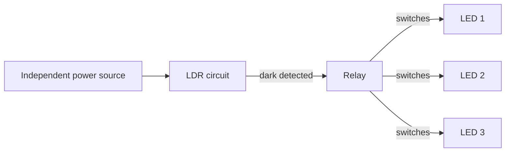

# SafeGuard Helmet — Hardware Connections

Full wiring reference for both Arduino Nano units in the helmet, plus the independent LDR/relay headlamp circuit. Pin numbers below match the finalized integration firmware (`firmware/Phase-09_DualNano_Integration/Nano1_SensorNode.ino` and `Nano2_CommNode.ino`).

---

## System Overview

> The LDR + LED headlamp is a **separate, independent circuit** — it is not wired to either Nano. See §3.

---

## 1. Nano #1 — Sensor Node

### 1.1 Component list
Ultrasonic ×3, MQ-2 gas sensor, GY-30100 (MAX30100), Buzzer ×2, miniature vibration motor (via NPN transistor + AMS1117 regulator).

### 1.2 Pin connection table

| Subsystem | Pin | Nano #1 |
|---|---|---|
| **Ultrasonic 1 (Front)** | Trig | D2 |
| | Echo | D3 |
| **Ultrasonic 2 (Left)** | Trig | D4 |
| | Echo | D5 |
| **Ultrasonic 3 (Right)** | Trig | D6 |
| | Echo | D7 |
| **MQ-2** | AO (analog) | A0 |
| | VCC | 5V |
| | GND | GND |
| **MAX30100 (GY-30100)** | SDA | A4 |
| | SCL | A5 |
| | VCC | 5V (or 3.3V per module) |
| | GND | GND |
| **Buzzer 1** (obstacle alert) | Signal | D8 |
| **Buzzer 2** (gas/health alert) | Signal | D9 |
| **Vibration motor** | Control (via transistor base) | D13 |
| **Link to Nano #2** | RX / TX (SoftwareSerial) | D10 / D11 |

### 1.3 Vibration motor driver circuit
The motor cannot run directly off 5V (confirmed — it gets damaged). Drive it through an NPN transistor, powered from a separate AMS1117-regulated rail:

---

## 2. Nano #2 — Communication Node

### 2.1 Component list
ESP-01 (via HW-580 adapter board), SIM800L GSM module.

### 2.2 Pin connection table

| Subsystem | Pin | Nano #2 |
|---|---|---|
| **Link from Nano #1** | RX (Hardware Serial) | D0 — wired to Nano #1's D11 |
| **ESP-01 adapter (HW-580)** | Adapter TX → Nano RX | D2 |
| | Adapter RX ← Nano TX | D3 |
| | Adapter VCC | 5V |
| | Adapter GND | GND |
| **SIM800L** | TXD → Nano RX | D6 |
| | RXD ← Nano TX | D7 |
| | VCC | 5V (direct — see power note below) |
| | GND | GND |

> **ESP-01 note:** the HW-580 adapter has its own onboard 3.3V regulator and TX/RX level shifting, so it takes 5V directly from Nano #2 — no separate AMS1117 or voltage dividers needed for it.

### 2.3 Before uploading to Nano #2
Disconnect the D0 wire (coming from Nano #1) before uploading new code — otherwise the USB upload conflicts with it.

---

## 3. LDR + LED Headlamp (Independent Circuit — Not Connected to Either Nano)

The LDR does **not** connect to any Arduino. It's a self-contained circuit with its own power source:

All three white LEDs are wired in parallel (each with its own current-limiting resistor) and switched together by the relay. In darkness, the relay closes and all three turn on together as a single headlamp array — there is no separate status/warning LED in this design. Verification is visual only (relay click + LEDs on/off with ambient light) — no firmware test applies here.

---

## 4. Power Summary

| Rail | Powers | Source |
|---|---|---|
| 5V | Both Nanos, Ultrasonic ×3, MQ-2, MAX30100, Buzzer ×2, ESP-01 adapter, SIM800L | Main 5V supply |
| AMS1117-regulated | Vibration motor | Separate regulator off the main supply |
| Independent | LDR + relay + LED headlamp array | Its own separate power source, unrelated to the Nanos |

> **SIM800L power caveat:** currently powered directly from the Nano's 5V rail — tested working for SMS and calls individually. Under full-system load (all sensors + both radios running together), SIM800L's transmit current spikes (~2A peak) carry some brownout/reset risk. If instability appears once everything runs together, move SIM800L to its own dedicated 3.7–4.2V/~2A supply.

---

## 5. Software Connections (No Wiring)

- **WiFi:** ESP-01 connects to the local router (2.4GHz only)
- **Firebase Realtime Database:** `worker-safety-vest-92b97-default-rtdb.firebaseio.com`, writing to `/helmet1/live` (latest status) and `/helmet1/logs` (timestamped history) — same project as the vest, kept in a separate node
- **GSM:** SIM800L sends SMS / places a call to a configured emergency number on a critical (obstacle or gas) alert, cooldown-limited to avoid repeat alerts for the same ongoing condition

---

## ⚠️ Before pushing this repo publicly

`Phase-08_SIM800L_GSM_SOS/sim800l_call_test.ino` and `sim800l_msg_test.ino` have a real phone number hardcoded. `Phase-09_DualNano_Integration/Nano2_CommNode.ino`'s `EMERGENCY_NUMBER` will need the same treatment once filled in. Move these into a separate, `.gitignore`d config file before the repo goes public — same practice already recommended for the vest's WiFi credentials.

---

## Notes
- Pin numbers above are from the **finalized Phase 9 integration firmware** — the source of truth for the physical build, same convention as `VEST-CONNECTIONS.md`.
- This firmware has been written and is ready to upload, but has **not yet been physically tested as a complete combined system** (all sensors + both Nanos + ESP-01 + SIM800L running together) — that's the current next step.
