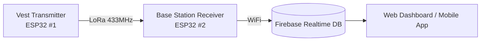
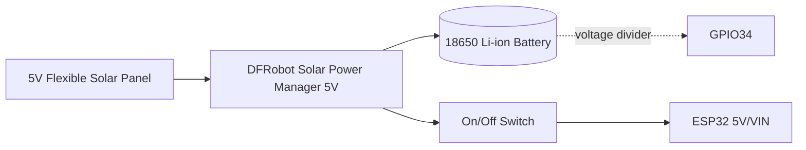

# Smart Safety Vest — Hardware Connections

Full wiring reference for both ESP32 units in the system: the **Vest Transmitter** (worn by the worker) and the **Base Station Receiver** (fixed location, gateway to WiFi/Firebase). Pin numbers below are taken directly from the finalized firmware (`firmware/Phase-09_System_Integration/transmitter_final.ino` and `receiver_final.ino`).

---

## System Overview



---

## 1. Vest Transmitter (Worker Unit — ESP32 #1)

### 1.1 Component list
BME280, MPU6050 (GY-521), NEO-M8N GPS, SX1278 RA-02 LoRa, SSD1306 OLED, SOS push button, active buzzer, status LED, SIM800L GSM (SOS SMS — moved here from the helmet), 18650 battery + voltage-divider monitor, 5V flexible solar panel, DFRobot Solar Power Manager 5V, on/off switch.

### 1.2 Pin connection table

| Subsystem | Pin | ESP32 GPIO |
|---|---|---|
| **LoRa (SX1278 RA-02)** | SCK | GPIO18 |
| | MISO | GPIO19 |
| | MOSI | GPIO23 |
| | NSS / SS | GPIO5 |
| | RESET | GPIO14 |
| | DIO0 | GPIO2 |
| | VCC | 3.3V |
| | GND | GND |
| **BME280** (I2C) | SDA | GPIO21 |
| | SCL | GPIO22 |
| | VCC | 3.3V |
| | GND | GND |
| **MPU6050 / GY-521** (I2C) | SDA | GPIO21 |
| | SCL | GPIO22 |
| | VCC | 3.3V |
| | GND | GND |
| | *(XDA, XCL, AD0, INT — not connected)* | | |
| **OLED SSD1306** (I2C) | SDA | GPIO21 |
| | SCL | GPIO22 |
| **GPS (NEO-M8N)** | TX → ESP32 RX2 | GPIO16 |
| | RX ← ESP32 TX2 | GPIO17 |
| | VCC | 3.3V / 5V |
| | GND | GND |
| **SOS push button** | Signal (internal pull-up, other leg → GND) | GPIO15 |
| **Active buzzer** | Signal | GPIO12 |
| **Status LED** | Signal | GPIO13 |
| **Battery monitor** | ADC input (via voltage divider) | GPIO34 |
| **SIM800L** (SoftwareSerial) | RX ← ESP32 TX | GPIO27 (through a voltage divider — SIM800L RX is 3.3V-max) |
| | TX → ESP32 RX | GPIO25 |
| | VCC | 3.7–4.2V — from the vest's existing 18650/solar power system (see 1.4) |
| | GND | GND |

> **I2C note:** BME280, MPU6050, and the OLED all share the same I2C bus (GPIO21/GPIO22). This works because each has a distinct default address — BME280 `0x76`/`0x77`, MPU6050 `0x68`, SSD1306 `0x3C` — so no conflict.

### 1.3 Battery monitoring circuit
GPIO34 reads the battery voltage through a **2:1 resistor voltage divider** (two equal-value resistors, e.g. 100kΩ + 100kΩ) from Battery+ to GND, with the midpoint going to GPIO34. Firmware reconstructs the real voltage as:
```
batteryVoltage = (analogRead(GPIO34) / 4095.0) * 2 * 3.3 * 1.1
```
(the `× 2` undoes the divider, `× 3.3` converts the ADC's 0–1 fraction to volts, `× 1.1` is an empirical correction factor for the ESP32 ADC's non-linearity.)

### 1.4 Power system

The solar panel charges the 18650 battery through the DFRobot Solar Power Manager, which also regulates output to the ESP32. The on/off switch sits inline between the power manager and the ESP32. A voltage divider taps off the battery line into GPIO34 for monitoring (see 1.3).

### 1.5 SIM800L SOS SMS (moved here from the helmet)
On a fall, SOS button press, or high-temperature alert, the transmitter sends an SMS via SIM800L to a configured emergency number, including the worker's last known GPS coordinates (as a Google Maps link) and the alert reason — cooldown-limited to 60s so an ongoing alert doesn't spam repeat messages. Implemented directly in `transmitter_final.ino`'s existing alarm-trigger block (the same condition that drives the buzzer/LED), reusing the vest's already-valid GPS fix rather than needing a separate location source.

**Why it moved from the helmet:** an emergency SMS is far more useful carrying real GPS location and confirmed fall/SOS status — both of which the vest already has — rather than helmet-only sensor data (obstacle/gas/vitals), which doesn't by itself indicate an emergency requiring outside help.

**Power:** SIM800L runs off the vest's existing 18650/solar power system (3.7–4.2V nominal), which is a natural match — no separate power supply needed, unlike the helmet where this was an open problem.

---

## 2. Base Station Receiver (Fixed Unit — ESP32 #2)

### 2.1 Component list
A second ESP32 DevKit V1 + a second SX1278 RA-02 LoRa module. No sensors — this unit only relays data from LoRa to Firebase over WiFi.

### 2.2 Pin connection table

| Subsystem | Pin | ESP32 GPIO |
|---|---|---|
| **LoRa (SX1278 RA-02)** | SCK | GPIO18 |
| | MISO | GPIO19 |
| | MOSI | GPIO23 |
| | NSS / SS | GPIO5 |
| | RESET | GPIO14 |
| | DIO0 | GPIO2 |
| | VCC | 3.3V |
| | GND | GND |

### 2.3 Software connections (no wiring)
- WiFi → local router/hotspot
- Firebase Realtime Database: `worker-safety-vest-92b97-default-rtdb.firebaseio.com`, writing to `/worker1` (live) and `/worker1/logs` (history)

---

## ⚠️ Before pushing this repo publicly

`firmware/Phase-09_System_Integration/receiver_final.ino` currently has the **real WiFi SSID and password hardcoded** as `#define WIFI_SSID` / `#define WIFI_PASSWORD` near the top of the file. `transmitter_final.ino` now also has an `#define EMERGENCY_NUMBER` placeholder that needs a real phone number filled in. Move all of these (and any other real credentials) into a separate config header that's excluded via `.gitignore` — e.g. `Secrets.h` — before these files go into a public GitHub repository, the same way `Phase-06_IoT_Cloud_Platform/Firebase_Config.h` is already set up as a placeholder-only file.

---

## Notes
- Pin numbers above are from the **finalized** integration firmware (Phase 9). Earlier individual-module sketches (Phase 3–5) used slightly different pins for some signals (e.g. the original SOS button test used GPIO4, and LoRa's DIO0 was GPIO26) — those were superseded during final integration, so use the table above as the source of truth for the physical build.
- Phase 9's own README currently still marks wiring as "to be documented" even though `transmitter_final.ino` / `receiver_final.ino` already contain the finalized pin definitions — worth updating that README to point here once this is merged in.
